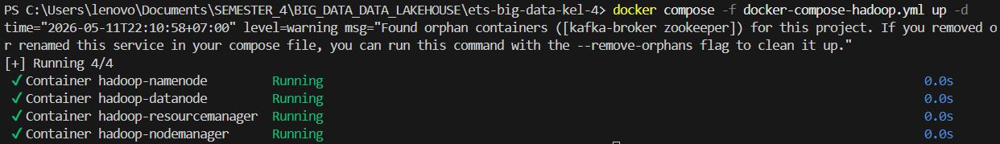
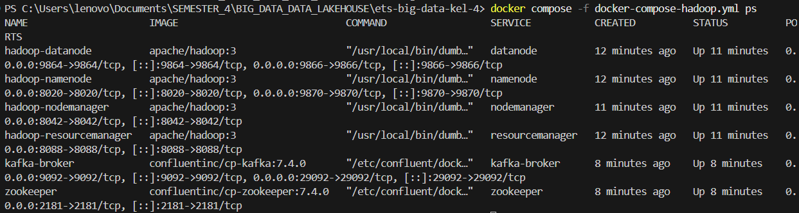
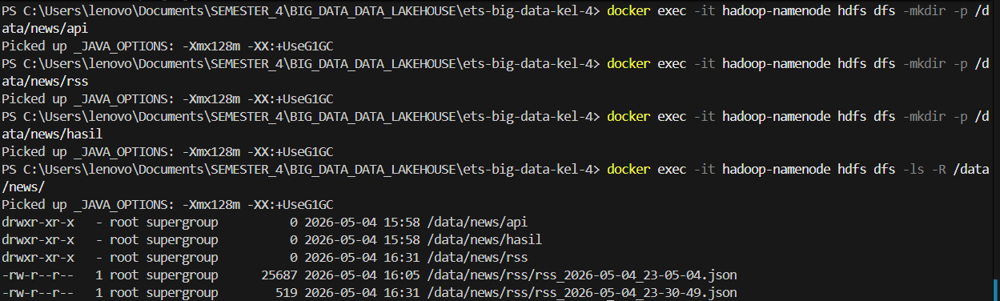
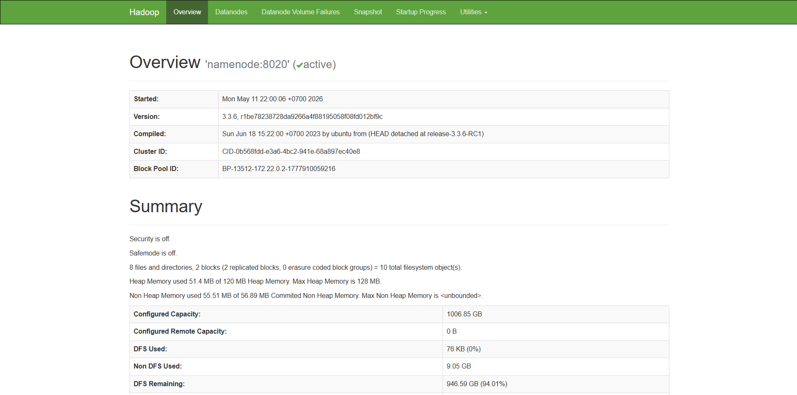
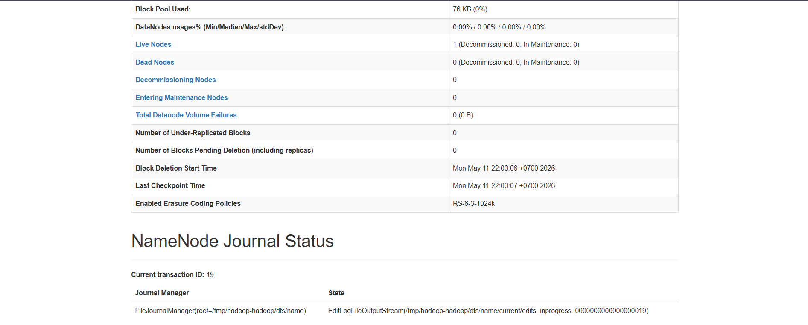
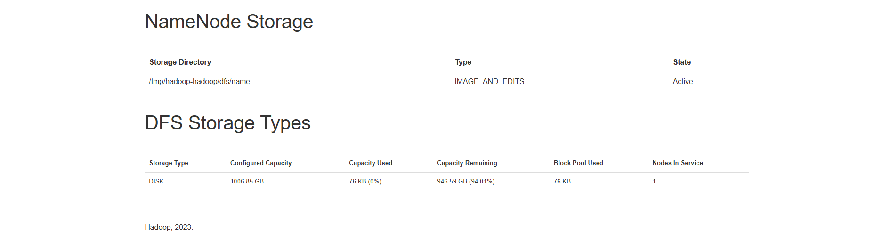
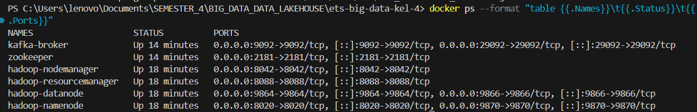
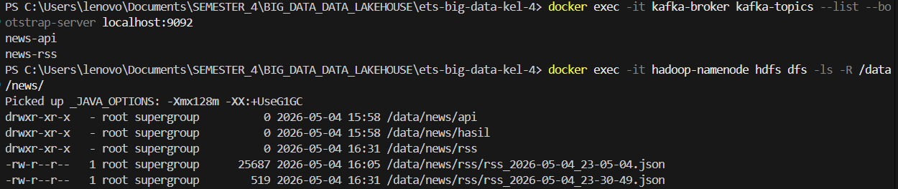
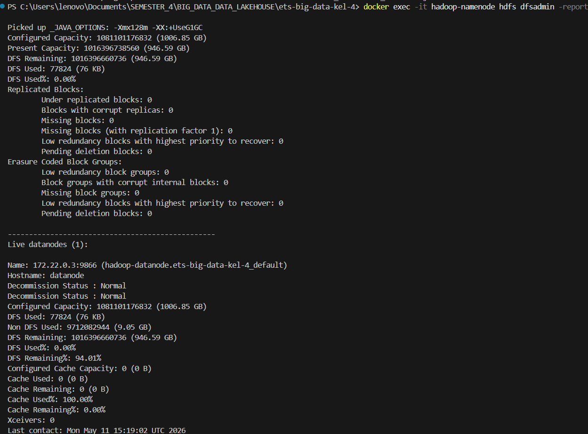

# Topik 5 — 🌍 NewsPulse: Analisis Tren Berita Nasional

---

## Anggota Kelompok & Kontribusi

| No | Nama | NRP | Kontribusi |
|:--:|------|-----|------------|
| 1 | Jonathan Zelig Sutopo | 5027241047 | **DevOps / Infrastructure** — Setup Docker Compose untuk Kafka & Hadoop, konfigurasi network antar container, pembuatan skrip otomasi (`setup_wsl.sh`, `run_wsl.sh`, `stop_wsl.sh`), pengelolaan HDFS directory structure, dan verifikasi end-to-end infrastructure. |
| 2 | Muhammad Ardiansyah Tri Wibowo | 5027241091 | **Kafka Producer API** — Integrasi GNews API untuk fetch top headlines, implementasi `producer_api.py` yang mengirim data JSON ke topic `news-api` (3 partisi), penanganan rate limit API, dan validasi data flow ke Kafka. |
| 3 | Muhammad Fatihul Qolbi Ash Shiddiqi | 5027241023 | **Kafka Producer RSS + Consumer HDFS** — Scraping RSS feed Kompas & Tempo via `producer_rss.py`, deduplikasi berita dengan hash URL 8 karakter, implementasi `consumer_to_hdfs.py` yang mem-buffer dan mengupload batch JSON ke HDFS `/data/news/`. |
| 4 | Erlangga Valdhio Putra Sulistio | 5027241030 | **Apache Spark Analysis** — Penyusunan PySpark job (`analysis.ipynb` & `run_analysis.py`) untuk analisis kata trending Top 15, distribusi sumber berita, volume per jam, dan bonus K-Means Clustering (TF-IDF + MLlib). Output ditulis ke `dashboard/data/spark_results.json`. |
| 5 | Tiara Putri Prasetya | 5027241013 | **Dashboard Flask** — Desain dan implementasi `dashboard/app.py`, halaman web interaktif dengan Chart.js (bar chart, horizontal chart, peta Indonesia), live feed berita, auto-refresh setiap 30 detik, dan integrasi dengan `spark_results.json`. |

---

## Topik yang Dipilih & Justifikasi

### Topik 5 — 🌍 NewsPulse: Analisis Tren Berita Nasional

**NewsPulse** adalah sistem big data real-time yang memantau dan menganalisis tren berita dari media nasional Indonesia (Kompas, Tempo) serta API berita global (GNews).

---

## Diagram Arsitektur Sistem

```
┌─────────────────┐     ┌─────────────────┐
│  GNews API      │     │  RSS Feeds      │
│  (top headlines)│     │  Kompas + Tempo  │
└────────┬────────┘     └────────┬────────┘
         │                       │
    producer_api.py         producer_rss.py
         │                       │
    ┌────▼────┐            ┌─────▼────┐
    │news-api │            │ news-rss │
    │ (Kafka) │            │ (Kafka)  │
    └────┬────┘            └────┬─────┘
         │                      │
         └──────┬───────────────┘
                │
       consumer_to_hdfs.py
                │
         ┌──────▼──────┐
         │    HDFS     │
         │ /data/news/ │
         └──────┬──────┘
                │
         analysis.ipynb (Spark)
                │
         ┌──────▼──────────┐
         │ spark_results   │
         └──────┬──────────┘
                │
         ┌──────▼──────────┐
         │  Flask Dashboard │
         │  localhost:5000  │
         └─────────────────┘
```

---


## Cara Menjalankan Project (WSL)

Disarankan jalankan project dari Ubuntu WSL agar dependency dan Docker integration lebih stabil.

### 0. Persiapan WSL

1. Install Docker Desktop, lalu aktifkan **Settings > Resources > WSL Integration** untuk distro Ubuntu kamu.
2. Buka terminal WSL, masuk ke folder project:

```bash
cd /mnt/d/Github/ets-big-data-kel-4
```

3. Siapkan environment file (opsional tapi direkomendasikan):

```bash
cp .env.example .env
# lalu isi GNEWS_API_KEY di .env
```

4. Jalankan setup otomatis:

```bash
chmod +x scripts/*.sh
./scripts/setup_wsl.sh
```

5. Jalankan seluruh pipeline:

```bash
./scripts/run_wsl.sh
```

6. Stop semua service:

```bash
./scripts/stop_wsl.sh
```

Dashboard akan tersedia di `http://localhost:5000`, dan analisis Spark akan di-refresh otomatis tiap 2 menit.

---

## Panduan Manual (Alternatif)

Jalankan perintah dari root project: `ets-big-data-kel-4`.

### 1. Siapkan Kafka dan Hadoop

```bash
docker compose -f docker-compose-kafka.yml up -d
docker compose -f docker-compose-hadoop.yml up -d
```

Buat topic Kafka dan folder HDFS:

```bash
docker exec -it kafka-broker kafka-topics --create --topic news-api --bootstrap-server localhost:9092 --partitions 3 --replication-factor 1
docker exec -it kafka-broker kafka-topics --create --topic news-rss --bootstrap-server localhost:9092 --partitions 1 --replication-factor 1

docker exec -it hadoop-namenode hdfs dfs -mkdir -p /data/news/api
docker exec -it hadoop-namenode hdfs dfs -mkdir -p /data/news/rss
docker exec -it hadoop-namenode hdfs dfs -mkdir -p /data/news/hasil
```


### 2. Install dependency Python

```bash
pip install kafka-python requests feedparser hdfs flask
```


### 3. Jalankan pipeline data

Buka terminal terpisah untuk setiap proses:

```bash
python kafka/producer_api.py
python kafka/producer_rss.py
python kafka/consumer_to_hdfs.py
```


### 4. Jalankan analisis Spark

Jalankan job Spark yang membaca data langsung dari HDFS dan menulis hasil olahan ke `dashboard/data/spark_results.json`:

```bash
python scripts/run_analysis.py --once
```

Jika ingin berjalan terus-menerus, gunakan mode watch atau jalankan `scripts/run_wsl.sh`:

```bash
python scripts/run_analysis.py --watch --interval 120
```

### 5. Jalankan dashboard

```bash
cd dashboard
python app.py
```


Buka `http://localhost:5000`.


### 6. Update analisis otomatis tiap 2 menit

Jalankan cron installer berikut supaya `spark_results.json` di-refresh setiap dua menit:

```bash
chmod +x scripts/*.sh
./scripts/install_cron_analysis.sh
```

Pantau log-nya dengan:

```bash
tail -f logs/cron_analysis.log
```

Jika ingin menghapus cron:

```bash
./scripts/remove_cron_analysis.sh
```

### 7. Cek hasil

- Kafka topic aktif: `docker exec -it kafka-broker kafka-topics --list --bootstrap-server localhost:9092`
- HDFS berisi data: `docker exec -it hadoop-namenode hdfs dfs -ls -R /data/news/`
- Hadoop UI: `http://localhost:9870`
- Dashboard Flask: `http://localhost:5000`


---

## A. Project Initialization (Anggota 1 — DevOps)

### 1. Setup Kafka via Docker Compose

```bash
docker compose -f docker-compose-kafka.yml up -d
docker compose -f docker-compose-kafka.yml ps
```


### 2. Create 2 Kafka Topics

```bash
docker exec -it kafka-broker kafka-topics --create --topic news-api --bootstrap-server localhost:9092 --partitions 3 --replication-factor 1
docker exec -it kafka-broker kafka-topics --create --topic news-rss --bootstrap-server localhost:9092 --partitions 1 --replication-factor 1
```


### 3. Verify Topics

```bash
docker exec -it kafka-broker kafka-topics --list --bootstrap-server localhost:9092
# Expected: news-api, news-rss
```


### 4. Setup Hadoop via Docker Compose

```bash
docker compose -f docker-compose-hadoop.yml up -d
docker compose -f docker-compose-hadoop.yml ps
```



### 5. Create HDFS Directory Structure

```bash
docker exec -it hadoop-namenode hdfs dfs -mkdir -p /data/news/api
docker exec -it hadoop-namenode hdfs dfs -mkdir -p /data/news/rss
docker exec -it hadoop-namenode hdfs dfs -mkdir -p /data/news/hasil
docker exec -it hadoop-namenode hdfs dfs -ls -R /data/news/
```


### 6. Verify HDFS Web UI

Buka browser → `http://localhost:9870`




### 7. Verify End-to-End Infrastructure

```bash
docker ps --format "table {{.Names}}\t{{.Status}}\t{{.Ports}}"
docker exec -it kafka-broker kafka-topics --list --bootstrap-server localhost:9092
docker exec -it hadoop-namenode hdfs dfs -ls -R /data/news/
docker exec -it hadoop-namenode hdfs dfsadmin -report
```




---

## B. Kafka Producer API (Anggota 2)

### 1. Install Dependencies

```bash
pip install kafka-python requests
```


### 2. Setup API Key

Daftar gratis di https://gnews.io → dapatkan API key → edit `GNEWS_API_KEY` di `kafka/producer_api.py`

### 3. Run Producer

```bash
python kafka/producer_api.py
```


### 4. Verify Data Flow

```bash
docker exec -it kafka-broker kafka-console-consumer --topic news-api --from-beginning --property print.key=true --bootstrap-server localhost:9092
```


---

## C. Kafka Producer RSS + Consumer HDFS (Anggota 3)

### 1. Install Dependencies

```bash
pip install kafka-python feedparser hdfs
```


### 2. Run Producer RSS

```bash
python kafka/producer_rss.py
```


### 3. Run Consumer to HDFS

```bash
python kafka/consumer_to_hdfs.py
```


### 4. Verify HDFS Data

```bash
docker exec -it hadoop-namenode hdfs dfs -ls -R /data/news/
```


---

## D. Apache Spark Analysis (Anggota 4)

### 1. Analisis yang dilakukan

| # | Analisis | Metode |
|---|----------|--------|
| 1 | Kata paling sering di judul (Top 15) | split() + explode() + filter stopwords |
| 2 | Distribusi berita per sumber | groupBy("sumber").count() |
| 3 | Volume publikasi per jam | HOUR(TO_TIMESTAMP(waktu_terbit)) |
| **Bonus** | K-Means Clustering (MLlib) | TF-IDF + K-Means (k=5) |

### 2. Run Notebook

```bash
# Di Jupyter Notebook lokal atau Google Colab
# Jalankan scripts/run_analysis.py atau buka spark/analysis.ipynb untuk eksperimen
```


**Catatan Colab:** Jika menggunakan Google Colab, export file JSON dari HDFS ke Google Drive terlebih dahulu.

---

## E. Dashboard Flask (Anggota 5)

### 1. Install Dependencies

```bash
pip install flask
```


### 2. Run Dashboard

```bash
cd dashboard
python app.py
# Buka http://localhost:5000
```


### 3. Fitur Dashboard

| Panel | Deskripsi | Data Source |
|-------|-----------|------------|
| Kata Trending Top 15 | Tabel kata + frekuensi | spark_results.json |
| Distribusi per Sumber | Bar chart Kompas vs Tempo vs GNews | spark_results.json |
| Volume per Jam | Bar chart 24 jam (**Bonus Chart.js**) | spark_results.json |
| Kata Trending Chart | Horizontal bar chart (**Bonus Chart.js**) | spark_results.json |
| Peta Indonesia | Distribusi berita per wilayah | spark_results.json |
| Feed Berita Terbaru | Live feed + auto-refresh 30 detik | spark_results.json |

### 4. Interpretasi Hasil Analisis

Berdasarkan visualisasi data yang tampil pada Dashboard di atas, berikut adalah penjelasan dari hasil *pipeline* big data yang telah kita kumpulkan:

1. **Kata Trending (Top 15)**: Menunjukkan isu yang sedang hangat dibicarakan di Indonesia saat ini. Kata-kata dengan frekuensi tertinggi merepresentasikan entitas (tokoh, kebijakan, atau tempat) dan topik utama yang mendominasi *headline* berita nasional dari berbagai sumber.
2. **Distribusi per Sumber Berita**: Menunjukkan perbandingan proporsi berita yang ditarik dari masing-masing portal (Kompas, Tempo, dan API global GNews). Melalui chart ini, kita bisa melihat portal mana yang mempublikasikan jumlah artikel terbanyak dalam rentang waktu penarikan data.
3. **Volume Publikasi per Jam**: Mengidentifikasi jam-jam sibuk (*peak hours*) aktivitas rilis berita. Grafik ini sangat berguna untuk melihat kapan media paling aktif menyebarkan informasi (misal: apakah terjadi lonjakan di pagi hari saat jam kerja dimulai, atau sore hari).

---

## Tantangan & Solusi

| Tantangan | Solusi |
|-----------|-------|
| RSS feed kadang lambat/timeout | Retry mechanism + timeout handler di producer |
| Duplikat berita antar RSS | Hash URL 8 karakter sebagai deduplication key |
| HDFS upload dari Windows | Docker cp + hdfs dfs -put via subprocess, fallback ke hdfs Python library |
| Spark baca dari HDFS | Spark job membaca path HDFS langsung, lalu dashboard hanya membaca output olahan Spark |
